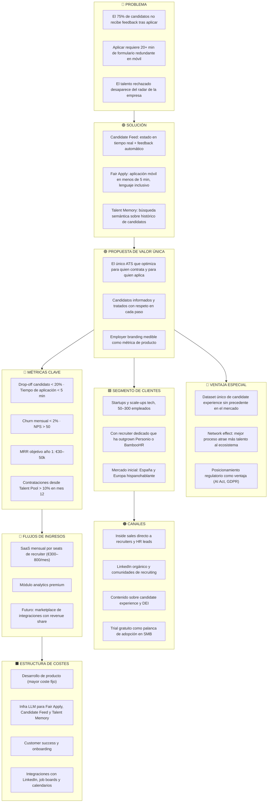
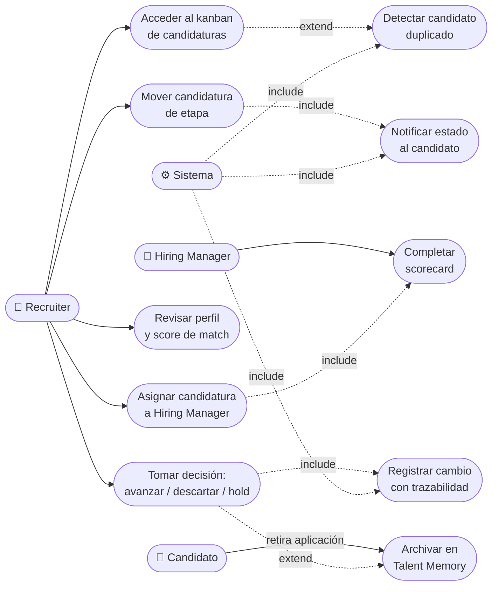
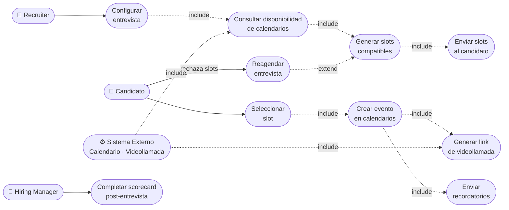
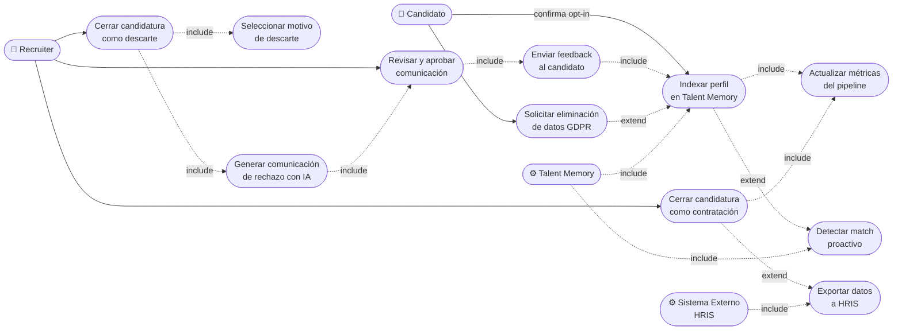
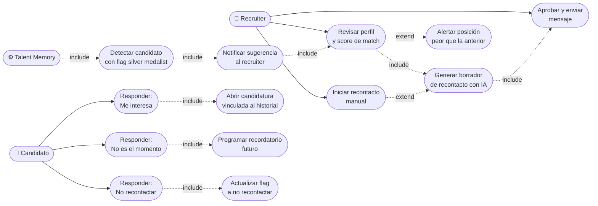
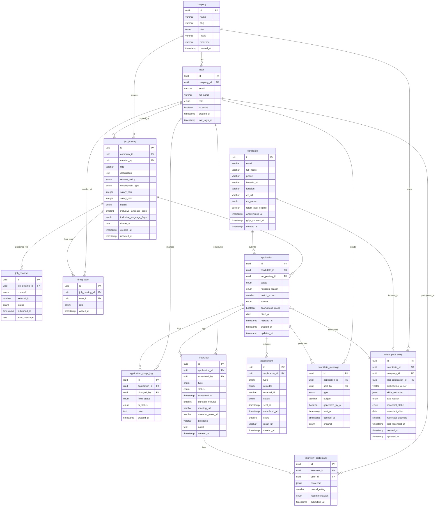
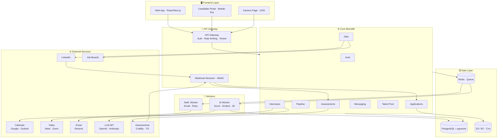

# LTI — Applicant Tracking System

LTI es un sistema de gestión de candidaturas diseñado para empresas en crecimiento que contratan con frecuencia y han dejado de conformarse con herramientas que solo funcionan para quien recluta. Cubre todo el ciclo de selección — desde la publicación de ofertas hasta la contratación — tratando al candidato como parte activa del proceso, no como un expediente que se mueve entre columnas.

---

## El problema que resuelve de forma distinta

Los ATS existentes optimizan para el recruiter. LTI optimiza para el resultado: atraer y retener al mejor talento posible, lo que implica que la experiencia del candidato no sea una ocurrencia tardía. Menos abandono en el proceso, mejor employer branding, y talento rechazado hoy convertido en contratación mañana.

---

## Ventajas frente a Greenhouse, Lever o Teamtailor

Sin la complejidad de enterprise ni el precio asociado. Sin formularios de aplicación que ahuyentan talento antes de la primera conversación. Con analítica que informa decisiones, no solo cuenta CVs. Y con el candidato informado en cada paso, algo que ninguno de los players actuales ha resuelto de forma nativa.

---

## Funcionalidades principales

- **Publicación multicanal**: una oferta, todos los canales relevantes — LinkedIn, Indeed, job boards locales — desde un solo lugar.
- **Fair Apply**: aplicación móvil en menos de 5 minutos mediante extracción automática de datos del CV, sin formularios redundantes y con análisis de lenguaje inclusivo en la oferta antes de publicarse.
- **Candidate Feed**: portal en tiempo real donde cada candidato ve el estado exacto de su proceso y recibe feedback automático personalizado al avanzar o ser descartado.
- **Pipeline y colaboración**: kanban visual por posición, scorecards, comentarios y notificaciones para hiring managers sin obligarles a aprender otra herramienta.
- **Talent Memory**: motor de búsqueda semántica sobre el histórico de candidatos para rescatar perfiles válidos cuando se abre una nueva posición.

---

## Lean Canvas



---

## Casos de uso principales — v1

Los tres casos de uso centrales del sistema se eligieron por maximizar simultáneamente el valor aportado y la complejidad de interacción entre actores. Un cuarto caso de uso extiende la propuesta diferencial de LTI más allá del ciclo de selección activo.

Los actores del sistema son: **Recruiter**, **Hiring Manager**, **Candidato** y **Sistema Externo** (job boards, calendario, videollamada, HRIS).

---

### CU-01 · Gestión del pipeline de candidatos

El caso de uso central del sistema. Todo lo demás orbita alrededor de este.

**Actores:** Recruiter (principal) · Hiring Manager · Candidato · Sistema Externo

**Precondiciones:**
- Existe al menos una oferta publicada y activa
- El candidato ha completado su aplicación mediante Fair Apply
- El Recruiter tiene acceso al pipeline de esa oferta
- El Hiring Manager está asignado a la posición

**Flujo principal:**

1. El Recruiter accede al kanban de la oferta y visualiza las candidaturas en "Nuevas aplicaciones"
2. El Recruiter abre el perfil: el sistema muestra CV parseado y score de match contra la job description
3. El Recruiter mueve la candidatura a "En revisión" — el sistema notifica al Candidato vía Candidate Feed con tiempo estimado de respuesta
4. El Recruiter asigna la candidatura al Hiring Manager con nota de contexto opcional
5. El Hiring Manager recibe notificación (email o Slack) con enlace directo al perfil, sin necesidad de acceder al ATS completo
6. El Hiring Manager completa el scorecard: valoración por competencias y comentario libre
7. El Recruiter revisa el scorecard y decide: avanzar → siguiente etapa / descartar → flujo de rechazo (CU-03) / en espera → flag "hold" con fecha de revisión
8. Si avanza: el sistema notifica al Candidato con el estado actualizado y el siguiente paso concreto
9. El sistema registra el cambio con timestamp, actor responsable y motivo — trazabilidad completa

**Flujos alternativos:**
- **FA-01** — El Hiring Manager no completa el scorecard en 48h: recordatorio automático; si no responde en 72h, notificación al Recruiter. El Candidato no percibe el bloqueo.
- **FA-02** — Candidato duplicado: el sistema alerta al Recruiter y permite gestionar las candidaturas de forma vinculada o independiente
- **FA-03** — El Candidato retira su aplicación: notificación al Recruiter, perfil archivado en Talent Memory con flag "retirada voluntaria"
- **FA-04** — Score de match anómalo (Recruiter avanza un candidato con score bajo): el sistema registra la discrepancia como señal de feedback al modelo, sin fricción para el Recruiter

**Postcondición:** La candidatura está en una etapa definida, el Candidato conoce su estado y el tiempo estimado hasta la próxima actualización, y existe trazabilidad completa de cada decisión.



---

### CU-02 · Agendado de entrevista con coordinación multiactor

El caso de uso donde más tiempo pierden los recruiters hoy. Un bucle de emails de disponibilidad que LTI colapsa en un flujo de tres pasos.

**Actores:** Recruiter (principal) · Hiring Manager · Candidato · Sistema Externo (Google Calendar / Outlook, Google Meet / Zoom)

**Precondiciones:**
- La candidatura está en una etapa que requiere entrevista
- Todos los participantes internos tienen el calendario conectado al sistema
- El Candidato tiene acceso a su Candidate Feed

**Flujo principal:**

1. El Recruiter configura la entrevista: tipo, duración, participantes y ventana de disponibilidad propuesta
2. El sistema consulta los calendarios de todos los participantes internos y genera 3 slots compatibles automáticamente
3. El sistema envía al Candidato los 3 slots vía Candidate Feed y email, con botón de selección directa — sin login
4. El Candidato selecciona su slot preferido
5. El sistema crea el evento en todos los calendarios con link de videollamada generado automáticamente y scorecard adjunto
6. El Candidato recibe confirmación con fecha, hora, link, nombres de entrevistadores y qué esperar de la sesión
7. El sistema envía recordatorios: a participantes internos 24h antes; al Candidato 24h y 1h antes
8. Post-entrevista: el sistema recuerda a cada entrevistador completar su scorecard en las 2h siguientes
9. El Recruiter consolida los scorecards y avanza el candidato en el pipeline (retorna a CU-01, paso 7)

**Flujos alternativos:**
- **FA-01** — El Candidato rechaza los 3 slots: puede indicar su disponibilidad general; el sistema recalcula. Tras dos rondas sin compatibilidad, notifica al Recruiter para gestión manual
- **FA-02** — Un entrevistador cancela con menos de 24h: notificación inmediata al Recruiter y al Candidato con disculpa explícita; reagendado automático si hay slots disponibles en 48h
- **FA-03** — El Candidato no se presenta: registro de ausencia, comunicación de seguimiento con opción de reagendar una única vez; si no hay respuesta en 48h, candidatura a "descartada — no presentado"
- **FA-04** — Entrevistador sin calendario conectado: se excluye del cálculo automático y se alerta al Recruiter
- **FA-05** — Zona horaria diferente: el sistema detecta la zona horaria del Candidato y muestra los slots en su hora local con indicación explícita

**Postcondición:** La entrevista está agendada en todos los calendarios, el Candidato tiene confirmación completa, los scorecards están preparados, y el pipeline refleja "entrevista agendada" con fecha y tipo.



---

### CU-03 · Cierre de candidatura y activación de Talent Memory

El caso de uso más ignorado por los ATS actuales y el más diferencial de LTI. El momento del rechazo o contratación no es el final del proceso — es el inicio de la siguiente contratación.

**Actores:** Recruiter (principal) · Candidato · Sistema (Talent Memory) · Sistema Externo (HRIS, opcional)

**Precondiciones:**
- La candidatura tiene una decisión final: contratado o descartado
- Si es descarte: existe al menos un motivo registrado (scorecard o nota del Recruiter)
- Si es contratación: la oferta ha sido aceptada por el Candidato

**Flujo principal — Rama A: Descarte:**

1. El Recruiter selecciona "Cerrar candidatura" como descartado e indica etapa y motivo principal (categoría + campo libre opcional)
2. El sistema genera la comunicación de rechazo personalizada: nombre del Candidato, puesto, etapa en que se descarta, motivo honesto ajustado a la categoría, agradecimiento proporcional al tiempo invertido
3. El Recruiter revisa y puede editar antes de enviar — nunca se envía sin revisión humana
4. El sistema envía la comunicación y registra el timestamp
5. El sistema indexa el perfil en Talent Memory: embeddings semánticos del CV, etapa alcanzada, motivo de rechazo, posición aplicada y flag de elegibilidad para recontacto (por defecto: sí)
6. El Candidato puede desde el Candidate Feed confirmar su opt-in para futuras posiciones o solicitar más detalle del feedback
7. El sistema cierra la candidatura y actualiza métricas del pipeline

**Flujo principal — Rama B: Contratación:**

1. El Recruiter cierra como "Contratado" con fecha de incorporación prevista
2. El sistema notifica al Candidato con mensaje de bienvenida y próximos pasos
3. El perfil se indexa en Talent Memory con flag "contratado" — referencia para entender qué perfiles tienen éxito en cada tipo de posición
4. Si hay integración HRIS activa: exportación de datos al sistema de RRHH para onboarding sin reintroducción manual
5. El sistema cierra la posición y actualiza todas las métricas de la oferta

**Flujos alternativos:**
- **FA-01** — El candidato contratado rechaza la oferta: el Recruiter registra el motivo, el sistema reactiva la posición y mueve al siguiente candidato en shortlist a "pendiente de decisión". El perfil se indexa con contexto completo.
- **FA-02** — Descarte sin comunicar (casos excepcionales: candidato conflictivo, proceso legal): el sistema permite omitirla pero lo registra como excepción auditada con justificación obligatoria
- **FA-03** — Talent Memory detecta match inmediato al cerrar: el sistema notifica al Recruiter con score de alineación y contexto del candidato descartado respecto a la posición abierta
- **FA-04** — El Candidato solicita eliminación de datos (GDPR): el sistema anonimiza todos los datos personales pero conserva los datos agregados de métricas (sin PII)

**Postcondición:** La candidatura está cerrada con trazabilidad. El Candidato ha recibido comunicación en menos de 24h. El perfil está indexado en Talent Memory. Las métricas del pipeline se han actualizado.



---

### CU-04 · Recontacto de candidato que rechazó la oferta

Un caso de uso con alto potencial y escasa cobertura en el mercado. Muchos candidatos que escogen entre varias ofertas no están completamente seguros de su decisión. Recibir un recontacto profesional y personalizado semanas o meses después — cuando la duda de si eligieron bien sigue presente — convierte con una tasa sorprendentemente alta. En recruiting se conoce como *silver medalist reengagement*.

**Actores:** Recruiter (principal) · Candidato · Sistema (Talent Memory)

**Precondiciones:**
- El Candidato rechazó una oferta en firme durante un proceso anterior
- El motivo registrado es "oferta rechazada — eligió otra empresa" (no descarte por fit, no retirada por insatisfacción con el proceso)
- Han transcurrido al menos 30 días desde el rechazo (configurable por el Recruiter)
- El Candidato tiene flag de elegibilidad para recontacto activo (opt-in explícito o por defecto)

**Flujo principal:**

1. El sistema detecta, al abrir una nueva posición, candidatos en Talent Memory con flag "rechazó oferta — eligió otra empresa" y alta alineación semántica con el nuevo rol
2. El sistema notifica al Recruiter: perfil del candidato, posición a la que aplicó, fecha del rechazo, motivo registrado y score de match con la nueva posición
3. El Recruiter revisa la sugerencia y decide iniciar el recontacto
4. El sistema genera un borrador de comunicación personalizada que:
   - Reconoce explícitamente el proceso anterior y el tiempo transcurrido
   - No trata al candidato como si fuera la primera vez
   - Presenta la nueva posición como genuinamente diferente o mejorada respecto a la anterior
   - Ofrece una conversación informal, sin presión de proceso formal inmediato
5. El Recruiter edita y aprueba el mensaje antes del envío
6. El Candidato recibe la comunicación y puede responder con tres opciones desde el Candidate Feed: "Me interesa", "No es el momento" (con campo de fecha estimada opcional) o "Prefiero no ser contactado de nuevo"
7. Si responde "Me interesa": se abre una candidatura nueva vinculada al historial anterior, sin repetir etapas ya completadas en el proceso previo
8. Si responde "No es el momento": el sistema programa un recordatorio al Recruiter para la fecha indicada y mantiene el flag de elegibilidad activo
9. Si responde "Prefiero no ser contactado": el sistema actualiza el flag a "no recontactar" de forma permanente y lo registra con timestamp

**Flujos alternativos:**
- **FA-01** — El Candidato no responde en 14 días: el sistema cierra el intento de recontacto sin reenvío automático y notifica al Recruiter. Un segundo intento requiere decisión manual explícita del Recruiter.
- **FA-02** — La nueva posición es sustancialmente peor que la anterior (menor seniority, menor salario estimado): el sistema alerta al Recruiter antes de generar el borrador, para evitar recontactos que dañen la relación
- **FA-03** — El Candidato ya está en otro proceso activo en la misma empresa: el sistema detecta el solapamiento y bloquea el recontacto hasta que el proceso activo se resuelva
- **FA-04** — El Recruiter inicia el recontacto manualmente sin sugerencia del sistema: flujo idéntico desde el paso 3, accesible desde el perfil del candidato en Talent Memory

**Postcondición:** El intento de recontacto está registrado con resultado explícito. Si el Candidato mostró interés, existe una candidatura nueva activa vinculada al historial previo. Si no, el flag de elegibilidad refleja la preferencia del Candidato de forma permanente.


---

## Modelo de datos — v1

### Entidades

#### `company`
Empresa cliente de LTI. Unidad raíz de aislamiento de datos — todo lo demás cuelga de aquí.

| Atributo | Tipo | Notas |
|---|---|---|
| id | UUID | PK |
| name | VARCHAR(255) | |
| slug | VARCHAR(100) | para URL de careers page |
| plan | ENUM | `starter`, `growth`, `pro` |
| locale | VARCHAR(10) | `es`, `en`, `pt`... |
| timezone | VARCHAR(50) | |
| created_at | TIMESTAMP | |

---

#### `user`
Cualquier persona con acceso al backoffice: recruiters, hiring managers y admins. Los candidatos tienen entidad propia por ciclo de vida y permisos radicalmente distintos.

| Atributo | Tipo | Notas |
|---|---|---|
| id | UUID | PK |
| company_id | UUID | FK |
| email | VARCHAR(255) | único |
| full_name | VARCHAR(255) | |
| role | ENUM | `recruiter`, `hiring_manager`, `admin` |
| is_active | BOOLEAN | |
| created_at | TIMESTAMP | |
| last_login_at | TIMESTAMP | nullable |

---

#### `job_posting`
La oferta de trabajo. Núcleo del ciclo de selección. El análisis de lenguaje inclusivo es campo de primera clase, no add-on.

| Atributo | Tipo | Notas |
|---|---|---|
| id | UUID | PK |
| company_id | UUID | FK |
| created_by | UUID | FK → user |
| title | VARCHAR(255) | |
| description | TEXT | |
| requirements | TEXT | |
| location | VARCHAR(255) | |
| remote_policy | ENUM | `onsite`, `hybrid`, `remote` |
| employment_type | ENUM | `full_time`, `part_time`, `contract` |
| salary_min | INTEGER | nullable, en cents |
| salary_max | INTEGER | nullable, en cents |
| salary_currency | VARCHAR(3) | `EUR`, `USD`... |
| status | ENUM | `draft`, `active`, `paused`, `closed` |
| inclusive_language_score | SMALLINT | 0-100, generado por IA |
| inclusive_language_flags | JSONB | array de términos problemáticos detectados |
| closes_at | DATE | nullable |
| created_at | TIMESTAMP | |
| updated_at | TIMESTAMP | |

---

#### `job_channel`
Dónde se publica cada oferta. Estado de sincronización propio por canal.

| Atributo | Tipo | Notas |
|---|---|---|
| id | UUID | PK |
| job_posting_id | UUID | FK |
| channel | ENUM | `linkedin`, `indeed`, `infojobs`, `careers_page`, `glassdoor` |
| external_id | VARCHAR(255) | ID de la oferta en el canal externo, nullable |
| status | ENUM | `pending`, `published`, `failed`, `withdrawn` |
| published_at | TIMESTAMP | nullable |
| error_message | TEXT | nullable |

---

#### `hiring_team`
Asignación de usuarios a una oferta. Controla quién puede ver, revisar y decidir sobre cada posición.

| Atributo | Tipo | Notas |
|---|---|---|
| id | UUID | PK |
| job_posting_id | UUID | FK |
| user_id | UUID | FK |
| role | ENUM | `recruiter_owner`, `recruiter_collaborator`, `hiring_manager`, `interviewer` |
| added_at | TIMESTAMP | |

---

#### `candidate`
El candidato. Separado de `user` con consentimiento GDPR explícito y soporte de anonimización. El actor más importante del sistema.

| Atributo | Tipo | Notas |
|---|---|---|
| id | UUID | PK |
| email | VARCHAR(255) | único |
| full_name | VARCHAR(255) | nullable si modo anónimo activo |
| phone | VARCHAR(30) | nullable |
| linkedin_url | VARCHAR(500) | nullable |
| location | VARCHAR(255) | nullable |
| timezone | VARCHAR(50) | nullable |
| cv_url | VARCHAR(500) | URL al fichero almacenado |
| cv_parsed | JSONB | CV estructurado extraído por IA |
| talent_pool_eligible | BOOLEAN | opt-in para recontacto futuro |
| anonymized_at | TIMESTAMP | nullable, si ejerció derecho GDPR |
| gdpr_consent_at | TIMESTAMP | |
| created_at | TIMESTAMP | |

---

#### `application`
Candidatura de un candidato a una oferta concreta. Tiene ciclo de vida propio e independiente.

| Atributo | Tipo | Notas |
|---|---|---|
| id | UUID | PK |
| candidate_id | UUID | FK |
| job_posting_id | UUID | FK |
| status | ENUM | `new`, `in_review`, `interview`, `offer`, `hired`, `rejected`, `withdrawn` |
| rejection_reason | ENUM | nullable: `profile_mismatch`, `stronger_candidate`, `salary_mismatch`, `failed_assessment`, `culture_fit`, `other` |
| rejection_notes | TEXT | nullable, interno |
| match_score | SMALLINT | 0-100, generado por IA al aplicar |
| source | ENUM | `linkedin`, `indeed`, `careers_page`, `referral`, `talent_pool`, `reengagement` |
| anonymous_mode | BOOLEAN | oculta datos PII al recruiter en fase inicial |
| hired_at | DATE | nullable |
| rejected_at | TIMESTAMP | nullable |
| created_at | TIMESTAMP | |
| updated_at | TIMESTAMP | |

---

#### `application_stage_log`
Historial inmutable de cada movimiento de una candidatura. Solo append — nunca se edita. Es la trazabilidad diferencial de LTI.

| Atributo | Tipo | Notas |
|---|---|---|
| id | UUID | PK |
| application_id | UUID | FK |
| changed_by | UUID | FK → user, nullable si lo hace el sistema |
| from_status | ENUM | status anterior |
| to_status | ENUM | status nuevo |
| note | TEXT | nullable |
| created_at | TIMESTAMP | inmutable |

---

#### `interview`
Sesión de entrevista concreta. Puede haber múltiples por candidatura en distintas etapas.

| Atributo | Tipo | Notas |
|---|---|---|
| id | UUID | PK |
| application_id | UUID | FK |
| scheduled_by | UUID | FK → user |
| type | ENUM | `screening`, `technical`, `cultural`, `final` |
| status | ENUM | `scheduled`, `completed`, `cancelled`, `no_show` |
| scheduled_at | TIMESTAMP | |
| duration_minutes | SMALLINT | |
| meeting_url | VARCHAR(500) | generado automáticamente |
| calendar_event_id | VARCHAR(255) | ID externo en Google/Outlook |
| timezone | VARCHAR(50) | |
| notes | TEXT | nullable |
| created_at | TIMESTAMP | |

---

#### `interview_participant`
Tabla de unión entre `interview` y `user`. Incluye el scorecard individual de cada entrevistador.

| Atributo | Tipo | Notas |
|---|---|---|
| id | UUID | PK |
| interview_id | UUID | FK |
| user_id | UUID | FK |
| scorecard | JSONB | respuestas por competencia, nullable hasta rellenar |
| overall_rating | SMALLINT | 1-5, nullable |
| recommendation | ENUM | nullable: `strong_yes`, `yes`, `neutral`, `no`, `strong_no` |
| submitted_at | TIMESTAMP | nullable |

---

#### `assessment`
Test online asociado a una candidatura. Soporta providers externos y tests nativos básicos en v1.

| Atributo | Tipo | Notas |
|---|---|---|
| id | UUID | PK |
| application_id | UUID | FK |
| type | ENUM | `technical`, `personality`, `cognitive`, `custom` |
| provider | ENUM | `lti_native`, `codility`, `testgorilla`, `hackerrank` |
| external_id | VARCHAR(255) | nullable |
| status | ENUM | `pending`, `sent`, `in_progress`, `completed`, `expired` |
| sent_at | TIMESTAMP | nullable |
| completed_at | TIMESTAMP | nullable |
| expires_at | TIMESTAMP | nullable |
| score | SMALLINT | nullable, 0-100 |
| result_url | VARCHAR(500) | nullable |
| created_at | TIMESTAMP | |

---

#### `candidate_message`
Registro de toda comunicación saliente hacia el candidato. Auditable: qué se le dijo, cuándo y si lo leyó.

| Atributo | Tipo | Notas |
|---|---|---|
| id | UUID | PK |
| application_id | UUID | FK |
| sent_by | UUID | FK → user, nullable si es automático |
| type | ENUM | `status_update`, `rejection`, `interview_invite`, `assessment_invite`, `reengagement`, `custom` |
| subject | VARCHAR(255) | |
| body | TEXT | |
| generated_by_ai | BOOLEAN | |
| sent_at | TIMESTAMP | |
| opened_at | TIMESTAMP | nullable |
| channel | ENUM | `email`, `candidate_feed` |

---

#### `talent_pool_entry`
El corazón de Talent Memory. Indexa perfiles para reutilización futura con búsqueda semántica mediante pgvector.

| Atributo | Tipo | Notas |
|---|---|---|
| id | UUID | PK |
| candidate_id | UUID | FK |
| company_id | UUID | FK |
| last_application_id | UUID | FK |
| embedding_vector | VECTOR(1536) | para búsqueda semántica (pgvector) |
| skills_extracted | JSONB | skills detectadas por IA |
| exit_reason | ENUM | `rejected`, `withdrew`, `declined_offer`, `hired` |
| recontact_status | ENUM | `eligible`, `not_now`, `do_not_contact` |
| recontact_after | DATE | nullable |
| recontact_attempts | SMALLINT | |
| last_recontact_at | TIMESTAMP | nullable |
| created_at | TIMESTAMP | |
| updated_at | TIMESTAMP | |

---

### Relaciones

| Relación | Cardinalidad | Notas |
|---|---|---|
| company → user | 1:N | una empresa tiene muchos usuarios |
| company → job_posting | 1:N | una empresa tiene muchas ofertas |
| company → talent_pool_entry | 1:N | una empresa acumula su propio talent pool |
| user → job_posting | 1:N | un usuario crea muchas ofertas |
| user → hiring_team | 1:N | un usuario puede estar en varios equipos |
| user → interview | 1:N | un usuario agenda muchas entrevistas |
| user → interview_participant | 1:N | un usuario participa en muchas entrevistas |
| user → application_stage_log | 1:N | un usuario genera muchos eventos de log |
| user → candidate_message | 1:N | un usuario envía muchos mensajes |
| job_posting → job_channel | 1:N | una oferta se publica en varios canales |
| job_posting → hiring_team | 1:N | una oferta tiene varios miembros de equipo |
| job_posting → application | 1:N | una oferta recibe muchas candidaturas |
| candidate → application | 1:N | un candidato puede aplicar a varias ofertas |
| candidate → talent_pool_entry | 1:1 | una entrada por candidato por empresa |
| application → application_stage_log | 1:N | una candidatura tiene muchos eventos de historial |
| application → interview | 1:N | una candidatura puede tener varias entrevistas |
| application → assessment | 1:N | una candidatura puede tener varios tests |
| application → candidate_message | 1:N | una candidatura genera muchos mensajes |
| application → talent_pool_entry | N:1 | la última candidatura referencia la entrada del pool |
| interview → interview_participant | 1:N | una entrevista tiene varios participantes |

---

### Diagrama ER



---

## Arquitectura de alto nivel — v1

### Estilo arquitectónico: monolito modular

La propuesta es un **monolito modular** — un único proceso desplegable, organizado internamente en módulos con fronteras explícitas y contratos definidos entre ellos. Cada módulo es potencialmente extraíble a un servicio independiente cuando haya razón real para hacerlo.

Dos servicios separados desde el inicio por requisitos de runtime radicalmente distintos:
- **AI Worker**: proceso asíncrono para jobs de IA (5-60s de ejecución). No debe bloquear el ciclo request-response principal.
- **Notification Worker**: proceso separado con retry logic propia para emails y webhooks a candidatos.

### Componentes principales

#### Frontend Layer
- **Web App** (React/Next.js): backoffice para Recruiters y Hiring Managers
- **Candidate Portal**: Candidate Feed mobile-first, acceso por token firmado sin necesidad de cuenta
- **Careers Page**: página pública de ofertas, estática y cacheada en CDN, branded por tenant

#### API Gateway
Punto de entrada único. Responsable de autenticación, routing, rate limiting y tenant resolution.

#### Core Monolith — módulos internos

| Módulo | Responsabilidad |
|---|---|
| Auth | JWT, refresh tokens, OAuth/SSO |
| Jobs | CRUD de ofertas, análisis de lenguaje inclusivo |
| Applications | Recepción de candidaturas, parsing, match score |
| Pipeline | Kanban, movimiento de etapas, trazabilidad |
| Interviews | Agendado, integración calendarios, videollamada |
| Assessments | Envío de tests, webhooks de resultados |
| Messaging | Generación y envío de comunicaciones al candidato |
| Talent Pool | Indexación de perfiles, búsqueda semántica, recontacto |
| Analytics | Métricas de pipeline, reports, candidate experience score |

#### Workers
- **AI Worker**: scoring de CVs, generación de embeddings, borradores de JD y comunicaciones, análisis de lenguaje inclusivo
- **Notification Worker**: envío de emails, gestión de reintentos con backoff exponencial, tracking de entrega

#### Data Layer
- **PostgreSQL + pgvector**: base de datos principal con extensión vectorial para Talent Memory
- **Redis**: caché de sesiones, rate limiting y cola de jobs (BullMQ)
- **Object Storage (S3/R2)**: CVs, attachments, assets — nunca en base de datos relacional

### Comunicación entre componentes

- **Síncrona (REST)**: Frontend → API Gateway → Monolito, para operaciones donde el usuario espera respuesta inmediata
- **Asíncrona (cola Redis)**: para procesamiento de CV, envío de emails, generación de embeddings — el monolito encola y devuelve 202, el worker procesa y actualiza
- **WebSockets**: actualizaciones en tiempo real del Candidate Feed (o polling cada 30s como alternativa en v1)
- **Webhooks entrantes**: resultados de assessments, confirmaciones de job boards, validados con HMAC

### Integraciones externas

| Servicio | Integración | Notas |
|---|---|---|
| LinkedIn | Jobs API + OAuth | Jobs API requiere aprobación de partner |
| Indeed / Infojobs | XML feed + API | Indeed acepta feed XML sin partnership |
| Google Calendar | Google Calendar API + OAuth por usuario | Tokens cifrados en BD |
| Outlook | Microsoft Graph API + OAuth | |
| Google Meet | Via Google Calendar API | Link generado al crear el evento |
| Zoom | Zoom API + OAuth | v1.1, Meet tiene prioridad en v1 |
| Resend / SendGrid | API REST | Email transaccional para todas las notificaciones |
| OpenAI / Anthropic | API REST | Llamadas desde AI Worker |
| Codility / TestGorilla | API + Webhook | LTI envía invitación, provider notifica resultado |

### Consideraciones de escalabilidad y seguridad

- **Multi-tenancy**: aislamiento por `company_id` + row-level security en PostgreSQL como segunda línea de defensa
- **Rate limiting**: por tenant y por IP en el API Gateway, especialmente crítico en endpoints públicos de aplicación
- **CVs y adjuntos**: URLs firmadas S3 de corta duración (15 min), nunca URLs públicas permanentes
- **Candidate Portal**: acceso por JWT firmado (7 días renovable), sin contraseña ni cuenta
- **Cifrado**: datos en reposo cifrados a nivel de disco; tokens OAuth de terceros cifrados a nivel de aplicación
- **Observabilidad**: logs estructurados JSON, error tracking (Sentry), métricas de aplicación desde el primer día
- **Backups**: snapshots diarios PostgreSQL con retención 30 días y point-in-time recovery

### Diagrama de arquitectura



---

## Diagrama C4 — Candidate Management

Los diagramas C4 se presentan en tres niveles de profundidad progresiva siguiendo la notación estándar C4 Model (Simon Brown). Convenciones usadas:

- `[Person]` — usuario humano que interactúa con el sistema
- `[Software System]` — sistema de software completo
- `[Container]` — aplicación o almacén de datos desplegable de forma independiente
- `[Component]` — unidad de código con responsabilidad definida dentro de un container
- `[Ext. System]` — sistema externo fuera del control de LTI
- Línea sólida → llamada síncrona (REST/función)
- Línea discontinua → llamada asíncrona o a sistema externo
- Boundary discontinuo → límite del sistema o container

---

### Nivel 1 · System Context

Muestra LTI ATS en su entorno: qué tipos de usuario lo usan y con qué sistemas externos se comunica. Sin tecnología ni componentes internos.

| Actor / Sistema | Tipo | Relación con LTI |
|---|---|---|
| Recruiter | `[Person]` | Gestiona pipeline, ofertas y decisiones |
| Hiring Manager | `[Person]` | Revisa candidatos y rellena scorecards |
| Candidato | `[Person]` | Aplica, ve estado y agenda entrevistas |
| Admin | `[Person]` | Configura empresa, usuarios y plan |
| LinkedIn | `[Ext. System]` | Publicación de ofertas y OAuth |
| Job Boards | `[Ext. System]` | Indeed, Infojobs, Glassdoor — XML/API |
| Calendar | `[Ext. System]` | Google Calendar / Outlook — disponibilidad y eventos |
| Email | `[Ext. System]` | Resend / SendGrid — notificaciones salientes |
| LLM · Tests | `[Ext. System]` | OpenAI/Anthropic para IA · Codility/TestGorilla para assessments |

```
┌─────────────────────────────────────────────────────┐
│                    PERSONAS                         │
│  [Recruiter]  [Hiring Manager]  [Candidato]  [Admin]│
└──────────────┬──────────────────────┬───────────────┘
               │  usa / interactúa    │
               ▼                      ▼
      ┌─────────────────────────────────┐
      │           LTI ATS               │
      │       [Software System]         │
      │  ATS de nueva generación        │
      └──────────────┬──────────────────┘
                     │  integra con
        ─ ─ ─ ─ ─ ─ ─┼─ ─ ─ ─ ─ ─ ─ ─ ─
        ▼             ▼             ▼
  [LinkedIn]    [Job Boards]   [Calendar]
  [Email]       [LLM · Tests]
```

---

### Nivel 2 · Container

Desglosa LTI en sus contenedores desplegables. Muestra qué tecnología usa cada uno y cómo se comunican entre sí y con el exterior.

| Container | Tecnología | Responsabilidad |
|---|---|---|
| Web App | React / Next.js | Backoffice para Recruiter y Hiring Manager |
| Candidate Portal | Next.js · Token auth | Candidate Feed móvil sin cuenta |
| Careers Page | Static · CDN | Página pública de ofertas branded por tenant |
| Backend API | Node.js · REST | Monolito modular con toda la lógica de negocio |
| AI Worker | Node.js · Queue consumer | Scoring de CVs, embeddings y generación de JDs |
| Notification Worker | Node.js · Queue consumer | Envío de emails con retry y delivery tracking |
| PostgreSQL + pgvector | Database | Base de datos principal con soporte de embeddings |
| Redis | Cache / Queue | Sesiones, rate limiting y cola de jobs asíncronos |
| Object Storage | S3 / R2 | CVs, adjuntos y assets de careers page |

```
[Recruiter/HM] ──► [Web App] ──────────────────┐
[Candidato]    ──► [Candidate Portal] ──────────┤
                   [Careers Page] ──────────────┤
                                                ▼
                              ┌─────────────────────────┐
                              │      Backend API         │
                              │  [Node.js · REST]        │
                              └──┬──────────┬────────────┘
                        encola   │          │  lee/escribe
                    ┌────────────┘          ▼
                    ▼                  [PostgreSQL]
               [Redis Queue]          [Redis]
               ┌────┴─────┐           [S3 / R2]
               ▼           ▼
         [AI Worker]  [Notif. Worker]
               │           │
               ▼           ▼
          [LLM API]    [Email Provider]
```

---

### Nivel 3 · Component — Backend API › Candidate Management

Profundiza dentro del Backend API mostrando los componentes internos responsables del ciclo de vida del candidato y sus dependencias.

| Componente | Tipo | Responsabilidad |
|---|---|---|
| Candidate Controller | `[Component · REST]` | Rutas HTTP, validación de input, auth guard por tenant |
| Application Service | `[Component · Domain]` | Orquesta el ciclo de vida de la candidatura |
| CV Parser | `[Component · AI]` | Extrae datos estructurados del CV via LLM |
| Scoring Engine | `[Component · AI]` | Calcula match score entre CV parseado y job description |
| Notification Service | `[Component · Messaging]` | Genera comunicaciones con IA y las encola para envío asíncrono |
| Repository Layer | `[Component · Data]` | Candidate Repo · Application Repo · Stage Log Repo |

Flujo principal al recibir una candidatura:

```
[Web App / Candidate Portal]
        │  REST / JSON
        ▼
[Candidate Controller]          ← valida input, auth guard
        │  delega
        ▼
[Application Service]           ← orquesta todo el ciclo
   ├──► [CV Parser]       ──►  [LLM API]   (extrae datos)
   ├──► [Scoring Engine]  ──►  [LLM API]   (match score)
   ├──► [Notification Service] ──► [Redis Queue] (encola email)
   └──► [Repository Layer]     ──► [PostgreSQL]  (persiste)
```

Relaciones de dependencia:
- `Application Service` es el único componente que coordina al resto — no hay dependencias circulares
- `Candidate Controller` no tiene lógica de negocio: solo HTTP → delegación
- `Repository Layer` es la única pieza que toca la base de datos directamente, lo que permite tests unitarios sin necesidad de base de datos real
- `CV Parser` y `Scoring Engine` se invocan de forma asíncrona para no bloquear la respuesta HTTP al candidato

---

## Prompts

> **Nota:** La planificación y estructuración de estos prompts fue trabajada previamente con Claude como asistente de discovery y diseño de sistema. Claude participó en la definición del alcance, la secuencia de preguntas y el enfoque de cada fase del ejercicio.

---

### Discovery y propuesta de valor

**Prompt 1 — Discovery del mercado ATS:**
```
Actúa como experto en HR Tech con experiencia en productos ATS
(Applicant Tracking Systems).
Necesito hacer el discovery de LTI, una startup que quiere construir
el ATS del futuro. Respóndeme:
1. ¿Qué problema core resuelve un ATS y para quién exactamente?
   (recruiters, hiring managers, candidatos)
2. ¿Qué players dominan el mercado hoy? (Greenhouse, Lever, Workday,
   BambooHR...) ¿Cuáles son sus principales debilidades?
3. ¿Qué pain points tienen los recruiters con los ATS actuales?
4. ¿Qué pain points tienen los CANDIDATOS con los procesos actuales?
5. ¿Dónde está entrando la IA en los ATS modernos y qué está
   funcionando vs. qué es hype?
6. ¿Qué funcionalidades serían el MVP razonable de un ATS moderno?
7. ¿Qué integraciones externas son críticas? (LinkedIn, job boards,
   calendarios, videollamadas...)
Sé específico. Quiero datos y ejemplos reales, no generalidades.
```

**Prompt 2 — Propuesta de valor y Lean Canvas:**
```
Basándote en el análisis del mercado ATS, ayúdame a definir la
propuesta de valor de LTI, startup que quiere crear el ATS del futuro.
El ciclo que cubre es:
1. Crear ofertas de trabajo
2. Publicarlas en múltiples canales
3. Recibir y centralizar candidaturas
4. Revisar y filtrar aplicaciones
5. Realizar tests online
6. Agendar entrevistas
7. Contratar candidatos seleccionados
Dime:
- ¿Cuál debería ser el diferencial competitivo de LTI frente a
  Greenhouse o Lever?
- ¿Qué 3 funcionalidades "wow" justificarían que una empresa
  se cambie al ATS de LTI?
- ¿Cuál sería el segmento de cliente ideal para empezar (ICP)?
- ¿Qué métricas de éxito tiene sentido medir?
Quiero construir el Lean Canvas con esta información.
```

---

### Descripción del producto y documentación

**Prompt 3 — Descripción de LTI:**
```
Redacta la descripción de LTI, un ATS (Applicant Tracking System)
de nueva generación. El texto debe incluir:
1. Qué es LTI (2-3 frases, sin buzzwords vacíos)
2. Qué valor añadido aporta
3. Sus ventajas competitivas frente a soluciones existentes
4. Sus 4-5 funciones principales
Tono: profesional pero directo. Máximo 300 palabras.
```

**Prompt 4 — Documentar en Markdown:**
```
Documenta esta salida en un documento markdown (.md)
```

**Prompt 5 — Lean Canvas en Mermaid:**
```
Genera un Lean Canvas para LTI (ATS del futuro) en formato Mermaid.
El Lean Canvas debe cubrir los 9 bloques:
- Problema (top 3 problemas)
- Segmento de clientes
- Propuesta de valor única
- Solución
- Canales
- Flujos de ingresos
- Estructura de costes
- Métricas clave
- Ventaja especial (unfair advantage)
Usa este formato Mermaid:
quadrantChart o bien un flowchart TD con nodos claramente
etiquetados por bloque. Prioriza legibilidad.
Si Mermaid no soporta bien el canvas, usa un flowchart con
subgraphs, uno por cada bloque del canvas.
Muéstramelo antes de añadirlo al .MD
```

---

### Casos de uso

**Prompt 6 — Casos de uso principales:**
```
Para el ATS LTI, identifica los 3 casos de uso PRINCIPALES
que todo el sistema debe soportar en su v1.
Para cada caso de uso, describe:
- Nombre del caso de uso
- Actor(es) principal(es)
- Precondiciones
- Flujo principal (paso a paso)
- Flujos alternativos o de error relevantes
- Postcondición
Los actores del sistema son: Recruiter, Hiring Manager,
Candidato, Sistema Externo (job boards, calendario, etc.)
Elige los 3 casos de uso que más valor aportan y más
complejidad de interacción tienen.
```

**Prompt 7 — Diagramas UML en Mermaid:**
```
Hazme en Mermaid un UML diagram de cada caso de uso y añádelo
```

---

### Modelo de datos

**Prompt 8 — Modelo de datos v1:**
```
Diseña el modelo de datos para la v1 del ATS LTI.
El sistema cubre este ciclo completo:
crear oferta → publicar en canales → recibir candidaturas →
revisar → tests online → entrevistas → contratación
Define:
1. Todas las entidades necesarias (mínimo 8)
2. Para cada entidad: nombre, atributos con nombre y tipo de dato
3. Relaciones entre entidades (tipo: 1:1, 1:N, N:M)
Después genera el diagrama ER en Mermaid (erDiagram) con:
- Todas las entidades y sus atributos tipados
- Todas las relaciones con cardinalidad
- Nomenclatura en inglés, snake_case
Sé exhaustivo pero no sobrediseñes: es una v1.
```

---

### Arquitectura

**Prompt 9 — Arquitectura de alto nivel:**
```
Diseña la arquitectura de alto nivel de LTI (ATS del futuro).
Contexto:
- SaaS multi-tenant
- Integraciones con: LinkedIn, job boards externos,
  Google Calendar / Outlook, Zoom/Meet, sistemas de email
- Usuarios: Recruiters, Hiring Managers, Candidatos
- Necesita IA para: scoring de CVs, recomendación de candidatos,
  generación de job descriptions
Describe:
1. Qué estilo arquitectónico propones y por qué
   (monolito modular, microservicios, etc.)
2. Qué componentes principales tiene el sistema
3. Cómo se comunican entre sí
4. Qué servicios externos integra y cómo
5. Consideraciones de escalabilidad y seguridad relevantes para v1
Luego genera un diagrama de arquitectura en Mermaid (flowchart TD
o graph LR) con todos los componentes y sus conexiones.
Agrupa por capas: Frontend / API Gateway / Services / Data / External.
```

---

### Diagramas C4

**Prompt 10 — Diagrama C4:**
```
Genera un diagrama C4 para el ATS LTI, profundizando en el
componente de "Candidate Management" (gestión del ciclo de vida
del candidato).
Nivel 1 - Context:
Muestra LTI ATS en el contexto de sus usuarios y sistemas externos.
Nivel 2 - Container:
Desglosa LTI en sus contenedores principales
(Web App, API, BD, servicios de IA, etc.)
Nivel 3 - Component:
Profundiza en el contenedor "Backend API" mostrando sus
componentes internos relacionados con Candidate Management:
- Candidate Controller
- Application Service
- CV Parser (IA)
- Scoring Engine
- Notification Service
- Repository layer
Usa la sintaxis Mermaid C4 (C4Context, C4Container, C4Component).
Un diagrama separado por nivel.
```
